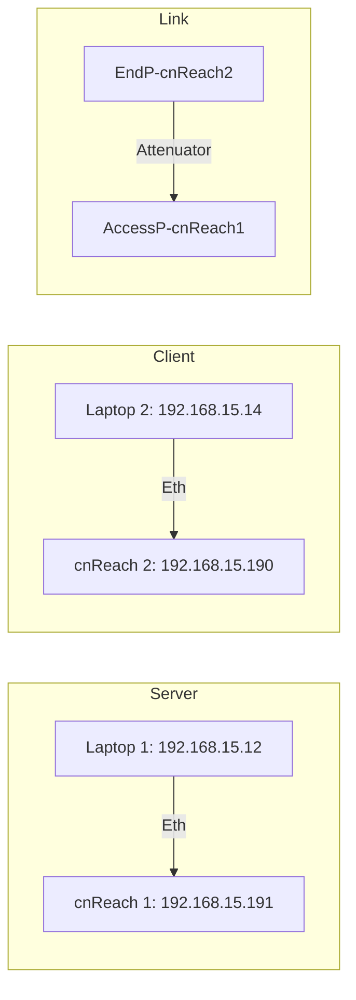
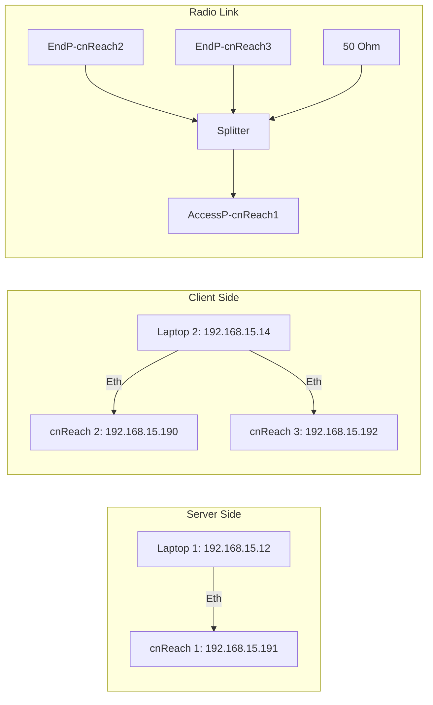

# cnReach Testing

## Test Setup - Solcomm Office - Point to Point Network


## iperf

iperf is used to test the throughput of the radios. This tests the Client to Server communication link.

Cd into the iperf directory

For the Server computer (Laptop 1)

```
iperf -s
```

For the Client computer (Laptop 2)

```
iperf -c <Server IP> 
```

## Preliminary Testing

### PTP Network

@50 dB attenuation

- Rx Only
- Tx Only
- Bi-directional

Testing from cnReach 2 Web UI


```
------------------------------------------------------------
Server listening on TCP port 5001
TCP window size: 64.0 KByte (default)
------------------------------------------------------------
[  4] local 192.168.15.12 port 5001 connected with 192.168.15.14 port 49279
[ ID] Interval       Transfer     Bandwidth
[  4]  0.0-14.4 sec   512 KBytes   292 Kbits/sec
```

### PTM Network

